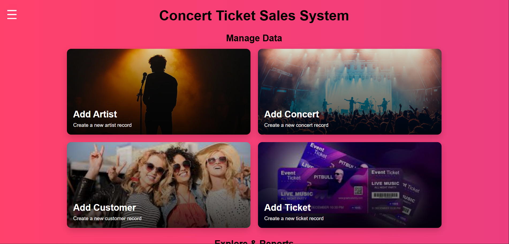
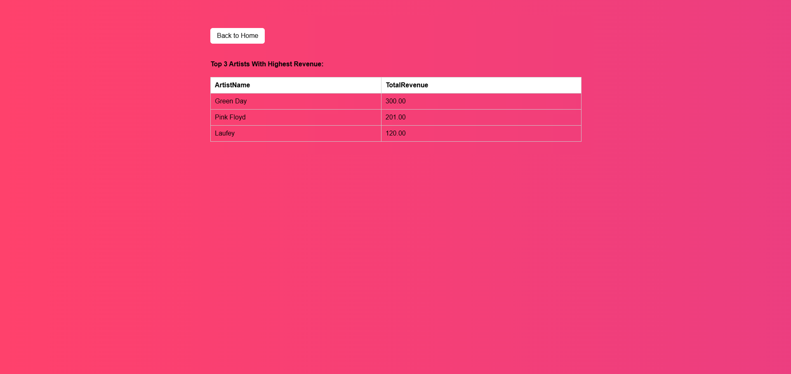

# concert-management-website

## Overview

  This is a full-stack web application designed to manage artists,
concerts, customers, and ticket sales. The system uses a relational
database to ensure data integrity and supports multiple queries and
reports for managing concert data effienctly.

---

## Features
This project includes:

  - Add and manage artists, concerts, customers, and tickets
  - View concerts filtered by artist, city, or date
  - Track customer purchases and total spending
  - Display top-performing artists based on ticket revenue
  - Enforce data integrity using foreign key constraints

---

## Technologies Used
Technoligies used included:

  - PHP
  - MySQL
  - HTML/CSS
  - Apache (UARK Turing Server)

---

## Database Design
The datasbase was designed using:

  - Relational schema with multiple tables (Artists, Concerts, Customers, Tickets, etc.)
  - Uses foreign key constraints to maintain referential integrity
  - Includes SQL file to recreate database structure

---

## Setup Instructions

  ### 1. Clone the repository
  '''bash
    git clone https://github.com/raperzac05-crypto/concert-management-website.git

  2. Set up the database
    - Open MySQL
    - Run:
      - source database.sql

  3. Configure database connection
     - Create a file named php_db.php

     Ex:
       $host = "localhost";
       $dbname = "your_database_name";
       $username = "your_username";
       $password = "your_password";

  4. Run the project
     - Place the files in your web server directly (e.g., Apache, htdocs)
     - Navigate to http://localhost/index.php

## Screenshots

### Home Page

### Add Artists

### Top Three Artists by Sales

## Notes
 - This project was orginally hosted on the University of Arkansas Turing server
 - A live demo is not publicly available, but full source code and setup instructions are included
